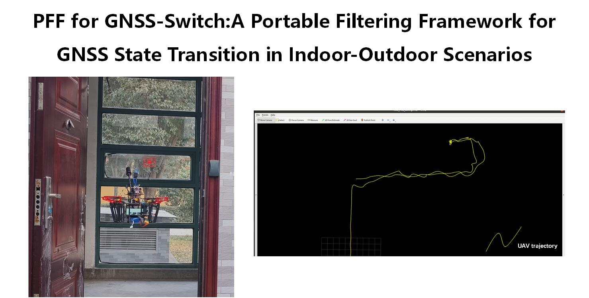
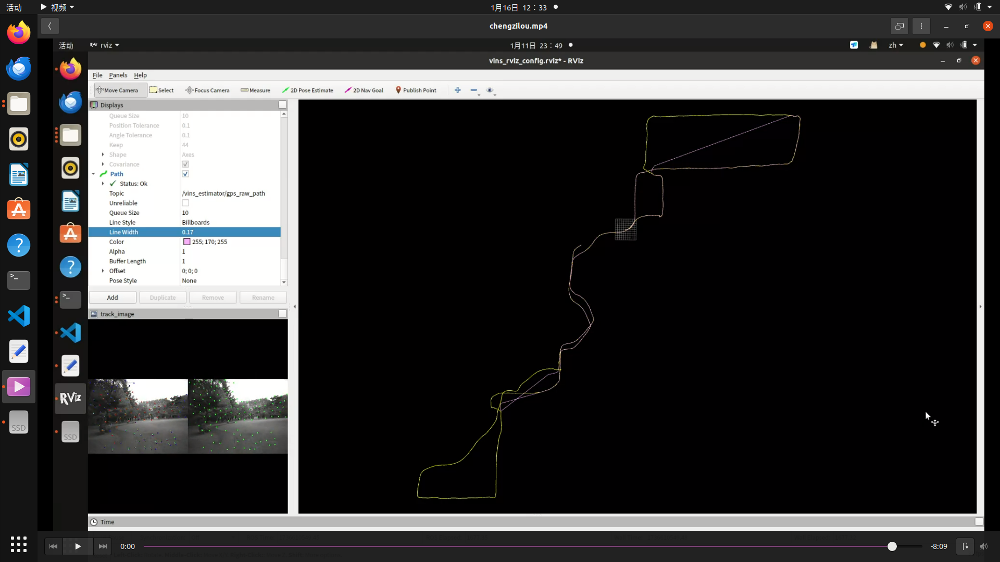
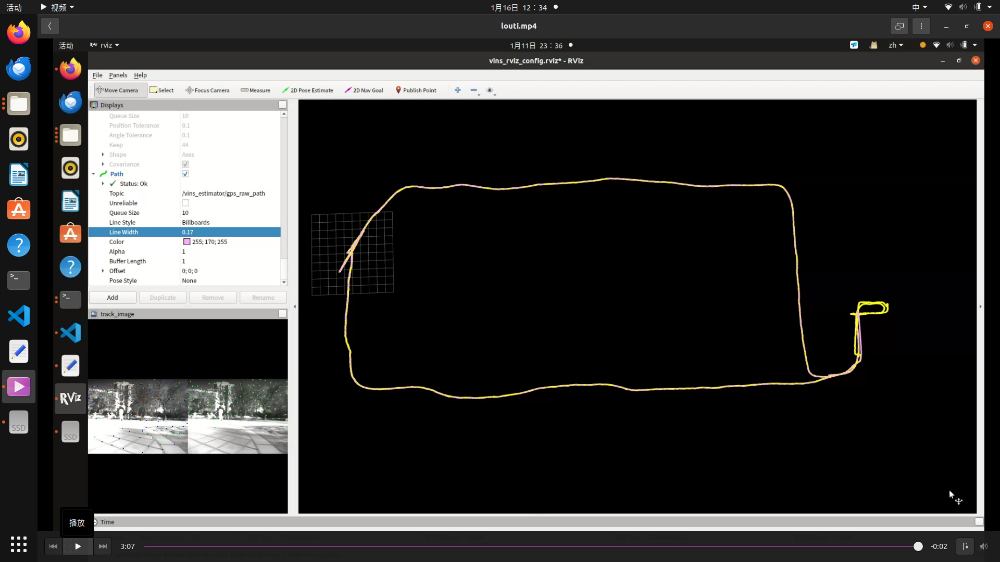
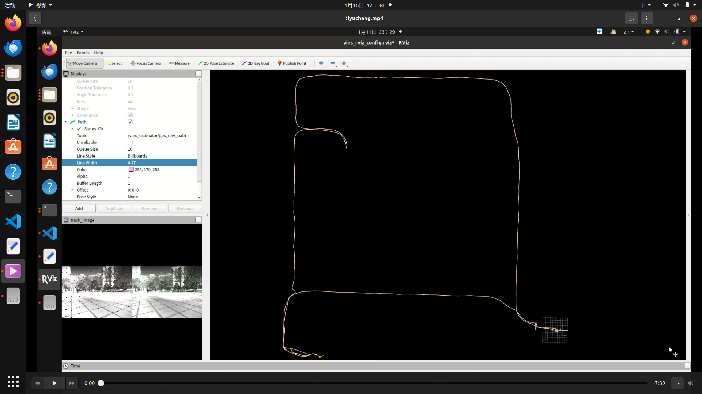
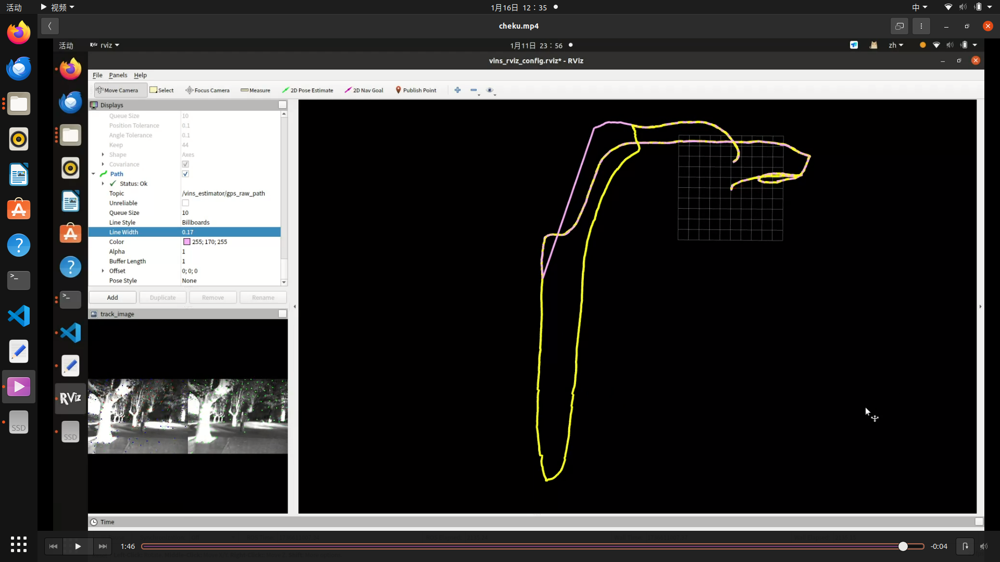

# PFF-for-GNSS-Switch
## PFF-for-GNSS-Switch-A-Portable-Filtering-Framework-for-GNSS-transition-in-indoor-outdoor-scenarios
We propose a multi-sensor fusion global positioning system based on vision, inertia, and GNSS, aided by loosely coupled Error State Kalman Filter (ESKF), to obtain accurate and stable six-degree-of-freedom pose during GNSS status changes. During the initialization phase, we addressed the GNSS degradation phenomena caused by the passive movement of the carrier and proposed an excitation detection method to reject GNSS signals that are significantly affected by noise. In the loosely coupled ESKF process, to address the GNSS status changes during the transition between indoor and outdoor environments, we designed a feedback buffering mechanism to constrain the error state vector in the ESKF process. This mechanism can not only overcome the accumulated errors of the degenerate system but also maintain the continuity and stability of the positioning results during GNSS status changes. Additionally, the ESKF system has structural portability and can be used for the integration of any local positioning system with GNSS signals. The results from practical flight experiments and running our proposed dataset, which involves challenging scenarios of transitioning between indoor and outdoor environments demonstrate that our algorithm can achieve high-precision, stable, and continuous global positioning both indoors and outdoors, with a reduction in Absolute Trajectory Error (ATE) of up to 70\% compared to the state-of-the-art GNSS fusion algorithms.

Click for the video demo.
[](https://youtu.be/oOds\_DIJLjQ)
## 1.Datasets
We collected seven sequences, comprising three indoor and four outdoor scenes. These sequences included challenging visual scenarios. such as featureless environments, frequent occlusions, abrupt lighting changes, overexposure, dynamic objects, and large-scale scenes. For indoor sequences, we utilized a motion capture system to acquire ground truth poses with millimeter-level accuracy. For outdoor sequences, Real-Time Kinematic (RTK) technology was employed to obtain ground truth trajectories with centimeter-level precision.
 
 
### 1.1Topics
```cpp
Stereostopic: /camera/infra1/image_rect_raw 15Hz,
              /camera/infra2/image_rect_raw 15Hz
imu: /mavros/imu/data_raw 200Hz
GNSS: /ublox_driver/receiver_lla 10Hz
      /ublox_driver/receiver_pvt 10Hz
      /ublox_driver/range_meas 10Hz
      /ublox_driver/ephem
      /ublox_driver/glo_ephem
      /ublox_driver/iono_params
      /ublox_driver/time_pulse_info 1Hz
ground truth: /mavros/global_position/raw/fix 10Hz
```
[PFF Datasets](https://pan.baidu.com/s/1T2Y2Snf3a4lgOBONi87eOw?pwd=4kkw).
